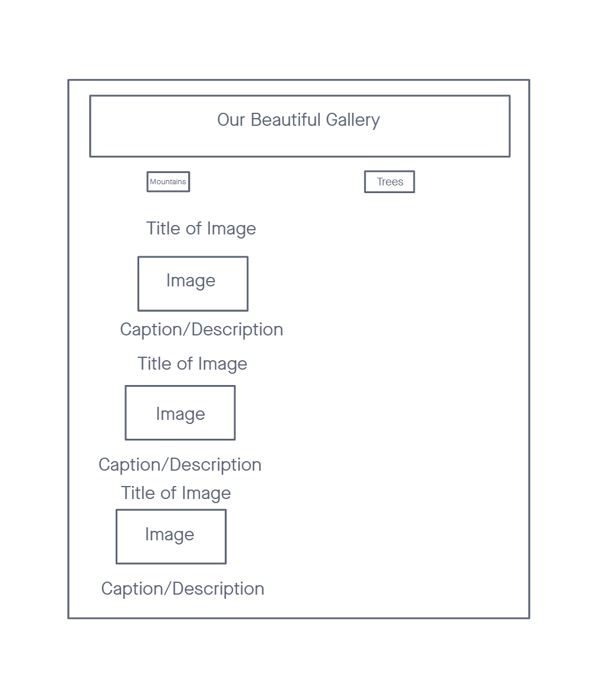

# "Structuring web pages with HTML" reading notes

## Wireframing

Wireframing is the process of "sketching out" what your want a webpage or web app to look like. Before wireframing, you should understand your audience, understand your content, and research how competitors are doing things. These preparations take time but are well worth it.

When you have a concept of what your project needs to accomplish, you can start wireframing properly. Using pen and paper, a whiteboarding tool, or even an image editor, you draft a simple black-and-white layout of your page. Then from this skeleton you write in what belongs in each content block.

With a good wireframe, the actual coding can begin with the important prep work guiding your efforts.

My partner Brady C. and I came up with the following wireframe for our Lab 04 assignment. Our intent was to make a basic image gallery using the limited HTML knowledge we had just learned.

## HTML

> Hyper Text Markup Language

HTML defines the composition for content to be displayed (and metadata to be stored) on webpages

## HTML Elements

- All HTML elements are made with angle brackets `<>`
- Many HTML elements must have an opening `
` and closing tag `
`.
- Keywords are often semantic - they have an implied meaning across platforms which can improve a webpage's portability.

### Types of elements

There are various HTML elements which enclose content so that it appears a certain way. A *very abbreviated* list of tags is as follows:

- `p` (paragraph)
- `h1` heading)
- `a` (anchor)
- `li` (list item)
- `button` (a clickable button)
- `nav` (navigation)
- `ul` / `ol` (undordered / ordered list)

Tags are used like so to create a HTML element:

    
my content

The opening and closing tags enclose the content to create a complete element, and your choice of tags and attributes will define how content is displayed. Attributes are written into tags `
` so that even more visual aspects and non-visual aspects of your content can be defined.

Elements such as `` are known as **empty elements**. Empty elements do not enclose content. In the case of ``, the tag will embed an image into the webpage.

## Essential text markup elements

- Headings
  - Heading elements define content which should be displayed as headings or subheadings. 
  - `h1` is used for the title.
  - `h2` is used for the top level heading.
  - `h3` is used for the first level of subheading(s).
  - The real purpose of headings is not to make text big. They are best used to define important webpage content for accessibility, portability, and search engine optimization (SEO).

- Paragraphs
  - More-or-less defines the "body text" of a page.
  - Regular text content should be enclosed by `
` tags.

- Lists
  - Unordered lists wrapped in `<ul>` will be bulleted
  - Ordered lists wrapped in `<ol>` will be numbered
  - `<li>` is used to wrap each item in a list

        <ul>
        <li>unorder lists</li>
        <li>order lists</li>
        </ul>

- Links
  - Hyperlinks consist of the visual text of the link, wrapped by `<a>` and `</a>`
  - A proper opening tag of a link `<a href="https://github.com/jeffreyjtech/reading-notes>` will contain the `href` attribute which sets the link's destination URL.
