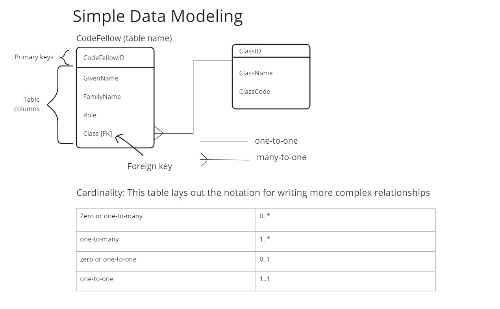

# Read 04 - Data Modeling

## [nosql vs sql](https://www.thegeekstuff.com/2014/01/sql-vs-nosql-db/?utm_source=tuicool)

### SQL vs. NoSQL

- SQL databases are relational databases vs NoSQL databases are non-relational
- SQL databases are table-based vs NoSQL databases are have a variety of data models.
- SQL databases have pre-defined schema vs NoSQL databases have dynamic schemas.
- SQL databases are vertically scalable vs NoSQL databases are horizontally scalable.

### SQL Advantages

- SQL query language is more powerful and allows for more complex manipulation of data
- SQL is better at handling complex queries, and have a fairly standard interface for doing so.
- SQL DBs are vertically scalable: increasing the power of the singular server hosting the DB will increase its performance.
- SQL DBs are better suited for high volumes of transactions.
- SQL DBs have better enterprise support.

### NoSQL Advantages

- NoSQl DBs are intrinsically more flexible than SQL DBs
- NoSQL DBs have horizontal scalability, meaning additional servers can be added to process more transactions.
- NoSQL DBs are better for hierarchical data storage.

## [sql modeling techniques](https://www.essentialsql.com/get-ready-to-learn-sql-7-simplified-data-modeling/)

I made the following diagram to record the key points of the article.

Other info:

- The cardinality table refers to notation for explaining complex data relationships within a relational database.
  - Using the simple terms is enough if data relationships aren't that complex.
- Keys are known as **compound keys** if they are have more than one column.
