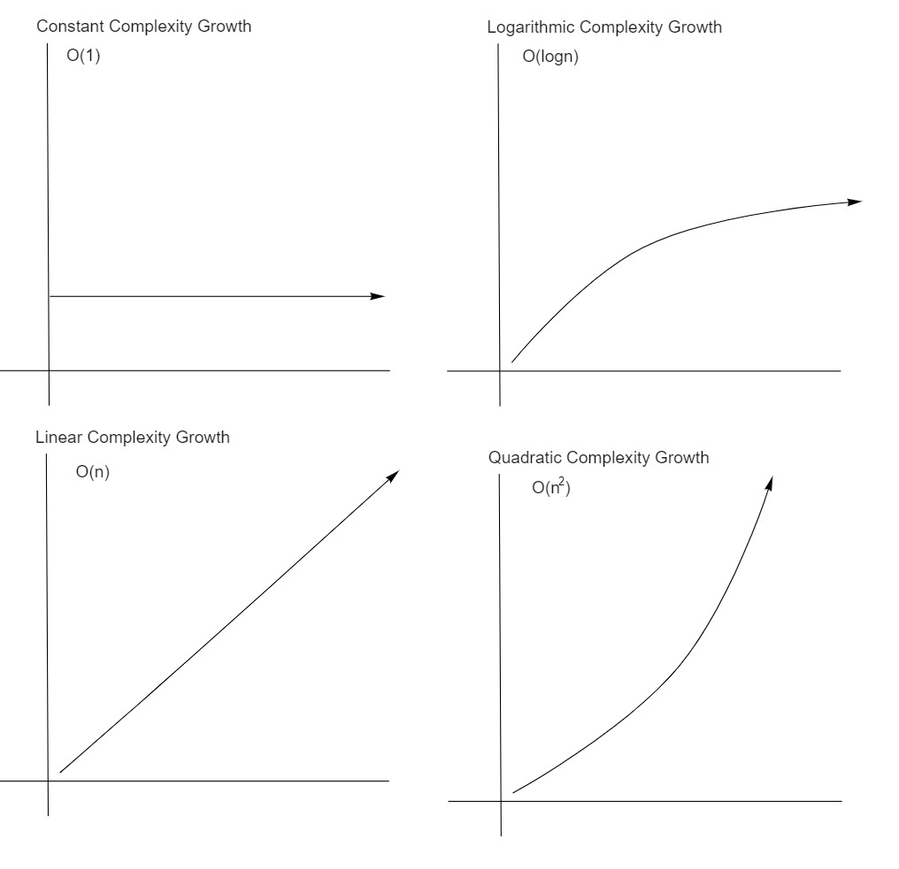

# Read 05 - Linked Lists

## But first Big O

### Overview

Big O notation is used to describe algorithm efficiency. This can be in 2 different dimensions: time efficiency and space efficiency. Big O, more specifically, describe's the efficiency in the **worst-case** use of an algorithm. The letter `n` refers to the size of the input.

### Units of Measure

Both time efficiency and space efficiency have common units of measurements. For time efficiency, it's the running time in milliseconds, the number of operations executed, and the number of *basic operations* executed. For space efficiency, the units are the amount of space occupied by the instructions that constitute your algorithm-as-written, the amount of space needed to store the input, the space needed for the output, and the space needed for working memory.

### Orders of Growth

The **Order of Growth** of an algorithm represents the proportionality of the size of the input to the time spent by an algorithm or the "memory space" used by an algorithm. These correspond to basic types of mathematical functions. They include:

The types shown above are sorted by best to worst (left-to-right, top-to-bottom). Constant Complexity Growth is the best, in fact, it's always the best. Logarithmic is great. Linear is not-great-but-not-terrible. Quadratic complexity is quite bad, but there are worse types not shown.

## Now to LinkedLists

Linked Lists are a linear dynamic data structure for storing data. Linear means they have an orderly, straight-line-ish structure and can only be searched in one direction (or two if it's reversible). Dynamic means that data can be added to it without completely rebuilding the data structure.

A linked list consists of nodes which contain two things: data (the stuff we want to store with this data structure) and a reference to next node. Nodes in a linked list are chained together by their references from one to the next. The first node is known as the head, and the last node is know as the tail.

Linked Lists are fantastic data structures in systems which have non-abstract memory allocation. A traditional array has a set size, because it takes up a sequence of addresses in memory. Without that pre-defined size limit, adding or removing data from an array would mess around with other data stored in the registry. Linked Lists get around this "set size" problem by being flexible in their shape across a memory registry. We can use whatever addresses we want, wherever we want because we just need one word (or two) to store the important stuff and the address for the next node. I use word in the computer science sense as an arbitrary bit set which is works as a system's "default container" size.

Anyways, Linked Lists are great. I was completely mystified by before reading about them and working with them. Now, I genuinely can't wait to learn about more data structures.

