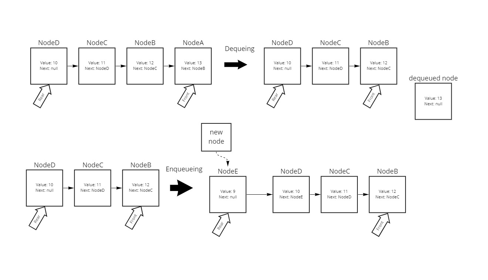
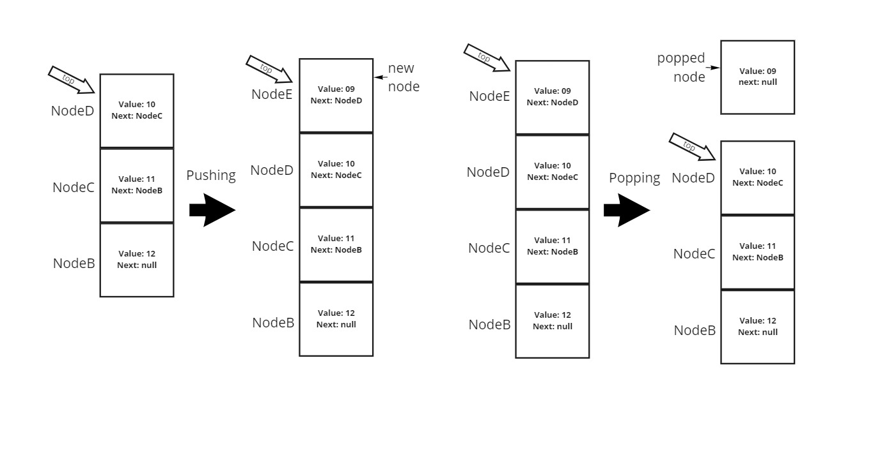

# Read 10 - Stacks & Queues

I made two diagrams to demonstrate stacks and queues and their fundamental methods.

- `Stack` methods not shown are `peek()`, which returns the value of the `top` node, and `isEmpty()`, which returns `true`/`false` if the stack is empty/not empty.
- `Queue` methods not shown are very similar: `peek()`, which returns the value of the `front` node, and `isEmpty()`, which works the same as stack's `isEmpty()`.

Missing methods aside, I think these diagrams accurately summarize that First-In-First-Out nature of stacks and the First-In-Last-Out nature of queues

STACKS:

QUEUES:

