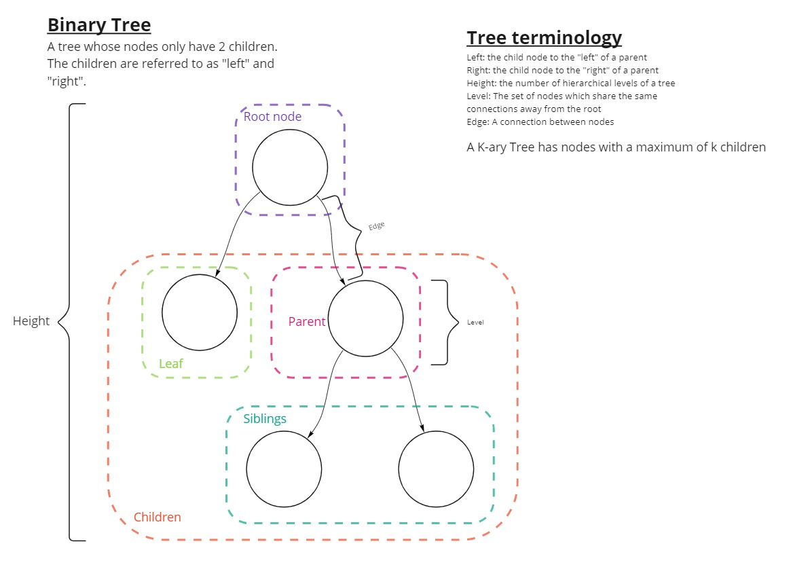

# Read 15 - Trees

I made the following diagram, which maps out the fundamental structure of trees and shows key terminology.

One method for interacting with a tree is a traversal. There are two major types

- Depth First
- Breadth First

Depth First traversals read all the values in a Tree by cycling through root nodes and subtrees in a particular order. They are most easily performed with a recursive function.

That order is determined by the subtype:

- Pre-order: root => left => right
- In-order left => root => right
- Post-order: left => right => root

Breadth First traversal means reading all values by level, starting with the root's level and ending with the farthest leaf's level. This can be done very efficiently with iterative logic and Queue.

## Binary Search Trees

Binary search trees are ordered trees where values (normally numerical values) are added onto programmatically by comparing new to values to existing values and adding a node to the appropriate place to fit the sorting scheme. Searching and adding nodes to a Binary Search tree can be done easily with recursive logic.

Binary search trees are super useful because when they are balanced (each subtree has approximately the same number of nodes), the time efficiency of searching one is O(log(n)), which is pretty danged good.
